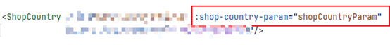
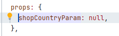
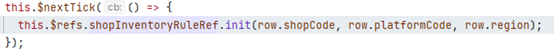
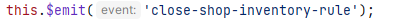

#### 父子组件之间的传值问题

##### 父组件向子传值

每一个shop都是一个父组件，shop下的每一个功都写成一个子组件，我们需要从父组件向子组件进行传值，如果有许多变量的话我们不应该一个一个传，这样看起来会显得杂乱无章，并且不符合面向对象的特性，我们可以把需要传递的值，全都封装到一个变量里面，在进行传值的时候，就只需要传递一个值。

* props:但是是异步的

在父组件用到子组件时，父组件中是这样的



shop-country-param就是子组件中用来接受的变量，子组件中这样



* rerfs:

  

  

调用子组件中的初始化方法，或者其他方法来进行传值。

在使用这种方法传递值的时候，使用v-if来控制组件，虽然执行了方法，但是组件还没有加载好，导致，数据没有传递过去。



this.$nextTick方法可以将里面的回调函数延迟到下次dom节点更新完成之后在执行。

##### 子向父组件传值的方法




#### 控制表格中各个行中的数据

##### this.$set(row,'key',value)

###### 修改某一行的row的某个按钮的加载状态：

场景：我点击了一个表格中某一行的按钮，我要让按钮处于加载中的状态。

实现：this.$set(row, 'downloading', true);

<el-button v-loading="Loading" size="small" type="text" @click="function1(scope.$index, scope.row)">
###### 我只改变某一行的数据而不是一个表（未测试）

```javascript
    changeRow(row, data) {
      // 遍历data对象的键
      let keys = Object.keys(data);
      for (let i = 0; i < keys.length; i++) {
        let key = keys[i];
        // 检查row对象是否包含相同的键
        if (row.hasOwnProperty(key)) {
          // 使用Vue的$set方法来替换row中的属性值
          this.$set(row, key, data[key]);
        }
      }
    }

```

##### 组件加载问题

当一个页面加载完了之后，就操作canvas,但是canvas还没有加载完，就会报错，所以我们需要在canvas加载完之后再进行操作。
甚至有时候钩子函数都不起作用。

```
Promise.resolve().then(() => {
      this.$nextTick(() => {
        this.showNotice();
      });
    });
```
