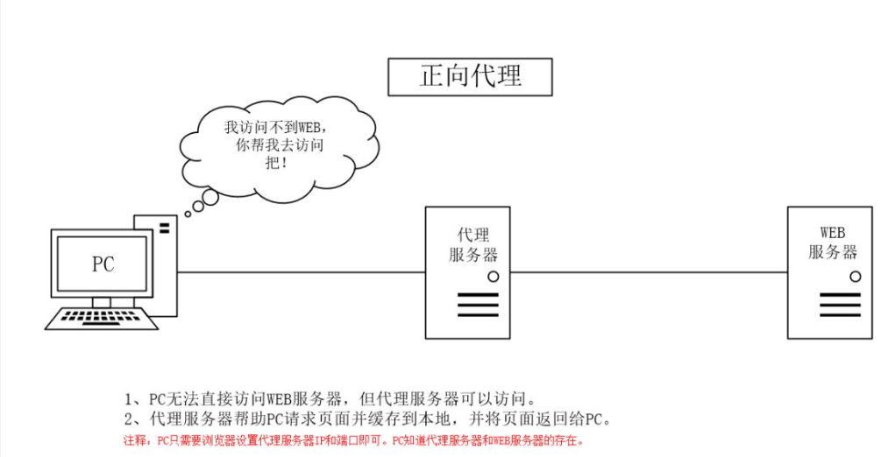
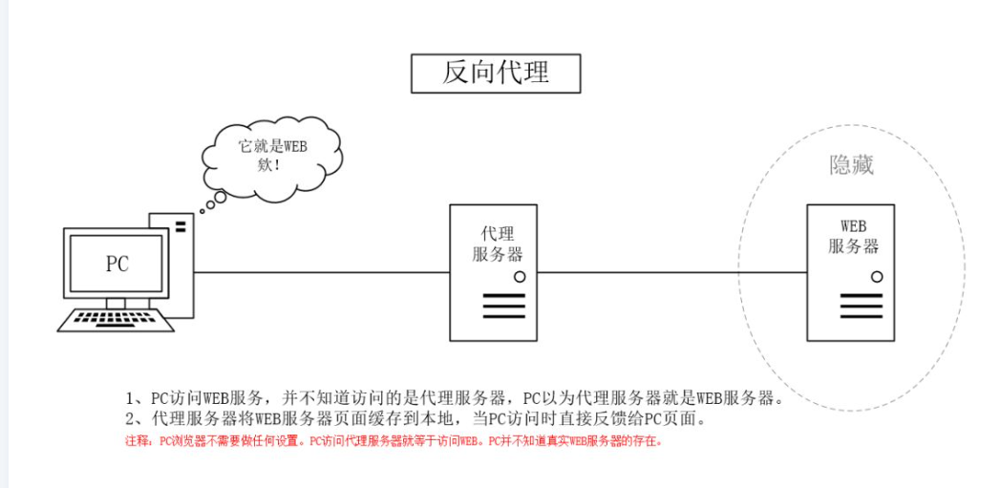

1. 正向代理
用户A想要访问一个B网站，但是因为一些原因（中国想要访问国外技术网站；一些网站限制了一些ip的访问等等），用户A的ip无法访问到B网站。
但是c服务器能访问B网站，用户也能访问到c服务器。这时候用户A就能够通过C服务器代理访问到B网站。

2. 反向代理
用户A访问B网站，在使用一些功能时，势必要访问一些B网站的api，访问api时用户是能够看到api的的目的地址的，B网站也是能够使用一个代理服务器C，
用户访问B网站的api时，只能看到服务器C的地址。而不能知道B网站的api的真正地址。
