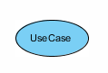
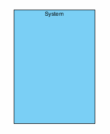
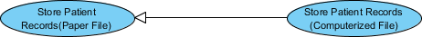
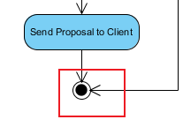
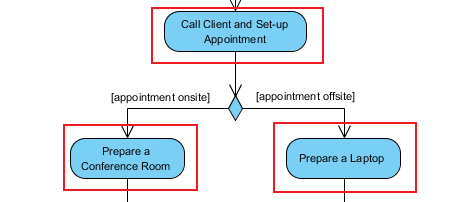
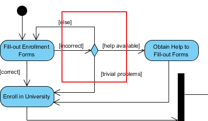
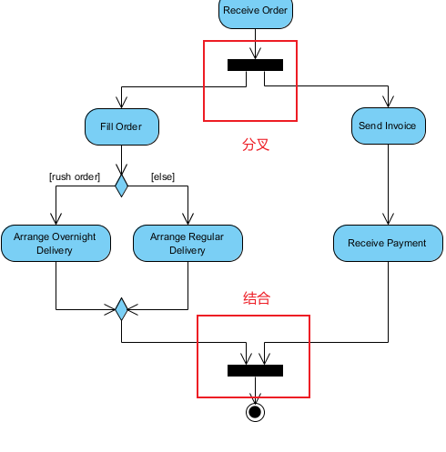
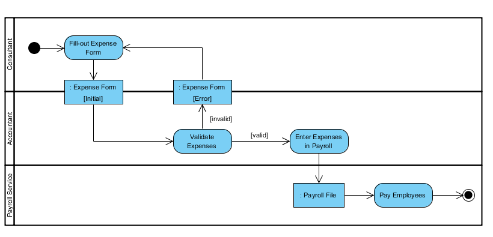
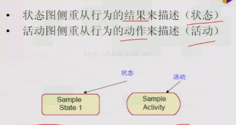

#### 用例图

**Actor:角色**

符号说明：

1. 角色与系统，也就是用例交互。
2. 与用户的概念类似，但一个用户可以扮演不同的角色。
3. Actor 对系统负有责任（输入），Actor 对系统有期望（输出）。

**Use case:用例**

符号说明：

1. 系统的功能
2. 由动词+名词（或名词短语）命名。
3. 每个参与者必须链接到一个用例，而某些用例可能不链接到参与者。

**通讯链接**

符号说明：

1. 参与者对用例的参与是通过将参与者与用例通过实体链接连接起来来显示的。
2. 参与者可以通过关联连接到用例，这表明参与者和用例使用消息相互通信。

**系统边界**

符号说明：

1. 系统边界里面就是定义的整个系统。

**用例关系**

extend

符号说明：

1. 如果我们执行系统的A用例时，不一定要去执行系统的B用例，B用例就是A用例的扩展，B-----<\<extend>>---->A。

include

符号说明：

1. 执行A用例时，我们必须先执行B用例，A-----------<\<include>>----------->B。

泛化

符号说明：

1. 泛化关系是用例之间的父子关系。
2. 子用例是父用例的增强。
3. 子用例在箭头底部连接。箭头的尖端连接到父用例。

**如何找出角色**

1. 谁使用该系统？
2. 谁来安装系统？
3. 谁启动系统？
4. 谁维护系统？
5. 谁关闭系统？
6. 还有哪些其他系统使用该系统？
7. 谁从这个系统获取信息？
8. 谁向系统提供信息？
9. 目前有什么事情会自动发生吗？

**如何找出用例**

1. 参与者希望从系统中获得什么功能？
2. 系统是否存储信息？哪些参与者将创建、读取、更新或删除这些信息？
3. 系统是否需要通知参与者内部状态的变化？
4. 系统是否必须了解任何外部事件？哪个参与者将这些事件通知系统？

#### 活动图

##### 简介

活动图(Activity Diagram)是描述满足用例要求所要进行的活动以及活动间的约束关系，有利于识别并行活动。它对于系统的功能建模特别重要，强调对象间的控制流程，活动图在本质上是一种流程图。

##### 元素说明

**初始节点**

解释：标记业务流程的开始，有且只有一个初始状态，用实心的圆点表示。

**终止节点**

解释：表示业务流程的终止，可以有一个或多个用一个实心圆外加一个圆圈表示。

**活动**

解释：业务流程中的执行单元

**判断/合并**

解释：判断就是根据条件而分成了不同的路径，每次只能走其中一条。合并指的是两个或多个控制路径在此汇合的情况。

**分叉/结合**

解释：分叉是指将一个控制流分成两个或者多个并行的分支。结合表示所有的并行分支在此汇聚，等所有的并行分支都完成了之后，业务才能继续往下走。

**转换**

解释：当上一个活动结束时，控制流会传递到另外一个控制节点，在活动图称之为"装换"，使用一个带箭头的直线来表示。

**泳道**

解释：代表了一个特定的类、人、部分、层次等等对象的职责区，每个泳道代表特定含义的状态职责的部分。在活动图中，每个活动只能明确的属于一个泳道，泳道明确的表示了哪些活动是由哪些对象进行的。

**状态**
