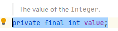

# 编程规范

## 命名规范

- 类名使用UpperCamelCase 风格。
- 方法名、参数名、成员变量、局部变量都使用 lowerCamelCase 风格。
- 常量命名全部大写，单词间用下划线隔开。
- 抽象类命名使用Abstract或Base开头；异常类命名使用Exception结尾；测试类 命名以它要测试的类的名称开始，以Test结尾。
- 数组类型定义时，需要类型与中括号紧挨相连。
- POJO类中布尔类型的变量，都不要加is，否则部分框架解析会引起序列化错误。
- 包名统一使用小写和单数形式，中间使用英文句号。
- 尽量使用完整的单词来定义编程元素，避免不规范的缩写。
- 如果模块、接口、类、方法使用了设计模式，在命名时需体现出具体模式。
- 接口类中的方法和属性不要加任何修饰符号，如果定义变量，肯定是与接口方法相关，并且是整个应用的基础常量。

### 定义类的一些注意事项

1. 对于Service和DAO类，基于SOA的理念，暴露出来的服务一定是接口，内部 的实现类用Im pl的后缀与接口区别。
2. 如果是形容能力的接口名称，取对应的形容词为接口名。
3. 枚举类名建议带上Enum后缀，枚举成员名称需要全大写，单词间用下划线隔开。

### Service/DAO 层方法命名规约

1. 获取单个对象的方法用 get 做前缀。
2. 取多个对象的方法用 list 做前缀，复数形式结尾如： listObjects。
3. 取统计值的方法用 count 做前缀。
4. 插入的方法用 save/insert 做前缀。
5. 删除的方法用 remove/delete 做前缀。
6. 修改的方法用 update 做前缀。

### 领域模型命名规约

数据对象： xxxDO， xxx 即为数据表名。

数据传输对象：xxxDTO, xxx为业务领域相关的名称。

展示对象： xxxVO， xxx 一般为网页名称。

POJO是DO/DTO/BO/VO的统称，禁止命名成xxxPOJO。

#### 对于java对象的DAO,DTO,BO,VO,PO和POJO等术语进行系统性的区分

1. **PO("Persistent Object"),是持久化对象，对应与数据库的一条记录，具有相同的字段名和数据类型PO常常被用作DAO（数据访问对象）层的数据模型。**
2. **VO(“Value Object”),在Java开发中，VO对象通常用于在不同层之间传递数据，例如在Controller层和Service层之间传递数据。VO对象和PO对象类似，但是它们的作用不同。VO通常是从PO对象中提取出来的一部分数据，用于展示和传递给前端界面。**
3. **BO("Business Object")，BO 是一种用于封装业务逻辑和数据的对象。**
4. **DTO（“Data Transfer Object”），DTO 通常用于在不同层之间传输数据，如前端和后端之间或不同微服务之间。**

## 常量定义

- 不允许任何未经预先定义的常量直接出现在代码中。
- 在long或者Long赋值时，数值后使用大写的L,不能是小写的I。
- 不要使用一个常量类维护所有常量，要按常量功能进行归类，分开维护。
- 常量的复用层次有五层

## java注释
@see 用于指定参考的类或者方法
@link 用于指定参考的类或者方法  例：{@link com.xhf.test.service.ChangeModel}
@throws 用于指定方法可能抛出的异常

# java对象与引用

## [基本数据类型和封装数据类型的引用原理](https://github.com/love-hai/Java_Study_test/blob/master/src/main/java/com/xhf/test/service/ChangeModel.java)

举个例子：

Integer的类源码中这样写的

使用了final修饰符，表明定义了一个Integer型的变量，它所引用的存储空间地址里面的数据是不会发生变化的。

所以我们可以这样认为使用了final修饰符的变量，它的引用性质与基本数据类型一样。

# Spring基础

## 面向切面编程

### 介绍：

AOP为Aspect Oriented Programming的缩写，意为：面向切面编程。将分散在各个业务逻辑代码中相同的代码通过横向切割的方式抽取到一个独立的模块中！

AOP是针对业务处理过程中的切面进行提取，它所面对的是处理过程的某个步骤或阶段，以获得逻辑过程的中各部分之间低耦合的隔离效果。

### 使用

#### 基于XML的声明式AspectJ

XML Schema配置方式，有点繁琐，暂时不考虑

#### AspectJ注解方式


| 注解名称        | 解释                                                                                                                                                                             |
| ----------------- | ---------------------------------------------------------------------------------------------------------------------------------------------------------------------------------- |
| @Aspect         | 用来定义一个切面类                                                                                                                                                               |
| @pointcut       | 对于切入点的定义，直接写一个空方法，返回Void                                                                                                                                     |
| @Before         | 前置方法                                                                                                                                                                         |
| @AfterReturning | 用于定义后置通知，在使用时可以指定pointcut / value和returning属性，<br />其中pointcut / value这两个属性的作用一样，都用于指定切入点表达式。<br />而retruning是指方法返回的对象。 |
| @Around         | 定义环绕通知                                                                                                                                                                     |
| @After-Throwing | 报错后通知                                                                                                                                                                       |
| @After          | 最终通知，不管你有没有出错                                                                                                                                                       |
| @DeclareParents | 用于定义引介通知，相当于IntroductionInterceptor (不要求掌握)。                                                                                                                   |

execution(modifiers-pattern? ret-type-pattern declaring-type-pattern? name-pattern(param-pattern)throws-pattern?)

* 修饰符匹配（modifier-pattern?）
* 返回值匹配（ret-type-pattern）：   可以为*表示任何返回值, 全路径的类名等
* 类路径匹配（declaring-type-pattern?）
* 方法名匹配（name-pattern）：可以指定方法名 或者 *代表所有, set* 代表以set开头的所有方法
* 参数匹配（(param-pattern)）：可以指定具体的参数类型，多个参数间用“,”隔开，各个参数也可以用"*" 来表示匹配任意类型的参数，".."表示零个或多个任意参数。
  如(String)表示匹配一个String参数的方法；(*,String) 表示匹配有两个参数的方法，第一个参数可以是任意类型，而第二个参数是String类型。
* 异常类型匹配（throws-pattern?）

## 事务注解 Spring @[Transactional](https://so.csdn.net/so/search?q=Transactional&spm=1001.2101.3001.7020)
|属性名|	说明|
|---|---|
|name|	当在配置文件中有多个 TransactionManager , 可以用该属性指定选择哪个事务管理器。|
|propagation|	事务的传播行为，默认值为 REQUIRED。|
|isolation|	事务的隔离度，默认值采用 DEFAULT。|
|timeout|	事务的超时时间，默认值为-1。如果超过该时间限制但事务还没有完成，则自动回滚事务。|
|read-only|	指定事务是否为只读事务，默认值为 false；为了忽略那些不需要事务的方法，比如读取数据，可以设置 read-only 为 true。|
|rollback-for|	用于指定能够触发事务回滚的异常类型，如果有多个异常类型需要指定，各类型之间可以通过逗号分隔。|
|no-rollback-for|	抛出 no-rollback-for 指定的异常类型，不回滚事务。|

### 事务传播行为
|属性名|	说明| 
|---|---|
|REQUIRED|	(默认) 如果当前存在事务，则加入该事务；如果当前没有事务，则创建一个新的事务。|
|SUPPORTS|	如果当前存在事务，则加入该事务；如果当前没有事务，则以非事务方式执行。这是与REQUIRED的区别之一，一般用于非事务性的方法，比如读取数据。|
|REQUIRES_NEW|	创建一个新的事务，如果当前存在事务，则把当前事务挂起。|
|NOT_SUPPORTED|	以非事务方式执行操作，如果当前存在事务，则把当前事务挂起。想要在事务中执行非事务方法|
|MANDATORY|	如果当前存在事务，则加入该事务；如果当前没有事务，则抛出异常。|
|NEVER|	以非事务方式执行，如果当前存在事务，则抛出异常。|


### 注意：

1. @Transactional注解加在实现类或实现类的方法上，不要加在接口上。
2. 只有在public方法上时生效。
3. 无论是@Transactional注解方式，还是@Aspect全局声明的方式，都是“仅外部调用时，事务才生效”。@Transactional注解只在外部调用时有效，也就是说，当一个方法被外部调用（比如从另一个类的方法中调用）时，@Transactional注解会启动一个新的事务。如果一个@Transactional注解的方法在同一个类内部被调用，事务不会启动。这是因为在同一个类内部调用方法时，Spring AOP无法拦截这个调用，所以无法将@Transactional注解的逻辑应用到这个调用上。
4. @Aspect和@Transactional注解不建议混合使用。若某个方法，不仅加了@Transactional注解，并且受@Aspect注解的全局事务控制，那么对于大多属性来说，@Aspect全局事务优先级更高，为避免造成混乱，不建议二者混用。
5. @PostConstruct注解的初始化方法，调用@Transactional注解的事务方法；或@PostConstruct与@Transactional同时注解的方法，事务机制可能不生效，因为要等代理完全初始化后，才可以提供事务功能。解决办法如下：

   ```
   @Autowired
   @Qualifier("transactionManager")
   protected PlatformTransactionManager transactionManager;@PostConstruct
   public void init() {
   	TransactionTemplate transactionTemplate = new TransactionTemplate(transactionManager);
       transactionTemplate.execute(new TransactionCallbackWithoutResult() {
            @Override
            protected void doInTransactionWithoutResult(TransactionStatus status) {
            		//此处调用事务方法
            }
        });
   }
   ```

## Spring注入

### 注意:

1. 要想使用@Autowired注入一个bean,必须要让Spring扫描到这个bean，所以要为这个bean添加上一个***@Service***注解服务或者***@Component***注解组件
2. 如果一个接口有多个实现类，该怎么注入。
   1. @Qualifier
      1. 注入时使用@Autowired
         @Qualifier("******")
      2. bean@Service或者@Component加上（"******")
   2. @Resource
      1. @Resource(name = "***") 或 @Resource(type =XXX.class )
3. 当一个bean里面有一些注入的其他bean,尽量使用依赖注入框架注入，如果使用new关键字来创建这个bean,这需要我们手动的处理所以依赖注入。

## Maven项目使用log4j

### maven依赖

```
<dependency>
    <groupId>org.projectlombok</groupId>
    <artifactId>lombok</artifactId>
    <version>1.16.10</version>
</dependency>

<dependency>
    <groupId>org.slf4j</groupId>
    <artifactId>slf4j-api</artifactId>
    <version>1.7.28</version>
</dependency>
```

### slf4j配置
[https://github.com/love-hai/Java_Study_test/blob/master/src/main/resources/log4j.properties]()

## java的序列化和反序列化问题
1. 序列化：将对象转换成有序字节序列的过程称为对象的序列化，方便这些对象在网络中传输，可以保存和重建
2. 反序列化：将字节序列恢复为对象的过程称为对象的反序列化。
